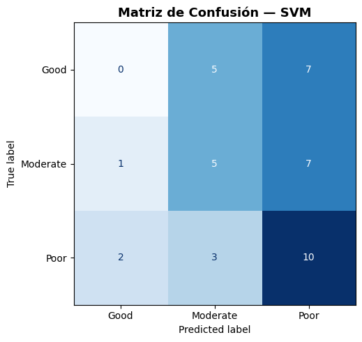
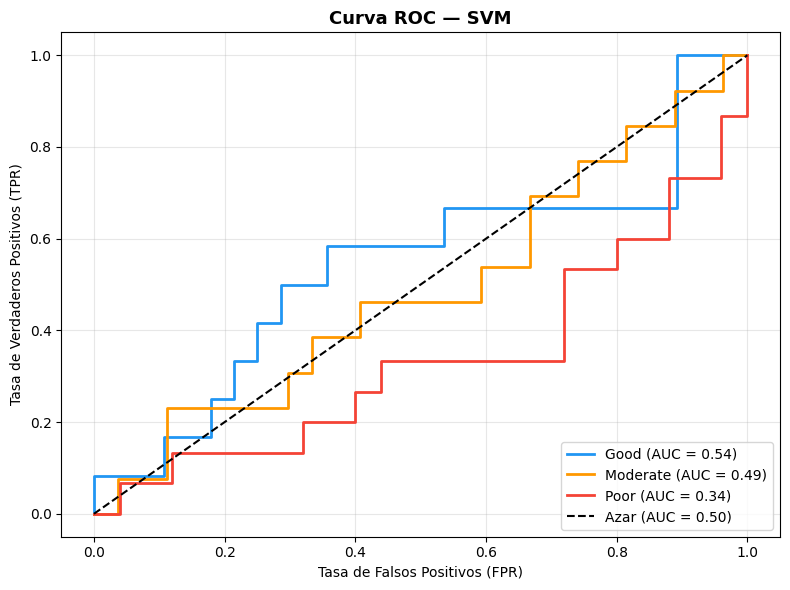

# Support Vector Machines

SVM es un modelo que busca encontrar el **hiperplano óptimo** que separa
las clases maximizando el **margen** entre ellas. Los puntos más cercanos
al hiperplano se denominan **vectores de soporte** y son los únicos que
definen la frontera de decisión.

Para problemas no linealmente separables, SVM utiliza el **kernel trick**,
que transforma los datos a un espacio dimensional superior donde sí son
separables:

$$f(x) = \sum_{i=1}^{n} \alpha_i y_i K(x_i, x) + b$$

Donde $K(x_i, x)$ es la **función kernel** que mide la similitud entre
puntos, y $\alpha_i$ son los pesos de los vectores de soporte.

----


### Crear Modelo


>Python Code


```python
from sklearn.svm import SVC

# ── 1. Modelo SVM ─────────────────────────────────────────────────
modelo_svm = SVC(
    kernel      = 'rbf',    # Kernel Radial Basis Function
    C           = 1.0,      # Penalización por error
    gamma       = 'scale',  # Coeficiente del kernel
    probability = True,     # Necesario para curva ROC
    random_state= 42
)

modelo_svm.fit(X_train_scaled, y_train)
```


### Predicciones y metricas

>Python Code


```python
# ── 2. Predicciones ────────────────────────────────────────────────
y_pred_svm = modelo_svm.predict(X_test_scaled)

# ── 3. Métricas ────────────────────────────────────────────────────
accuracy_svm = accuracy_score(y_test, y_pred_svm)
print(f"✅ Accuracy: {accuracy_svm*100:.2f}%\n")
print("📋 Reporte de Clasificación:")
print(classification_report(y_test, y_pred_svm))
```


>Output

```text
✅ Accuracy: 37.50%

📋 Reporte de Clasificación:
              precision    recall  f1-score   support

        Good       0.00      0.00      0.00        12
    Moderate       0.38      0.38      0.38        13
        Poor       0.42      0.67      0.51        15

    accuracy                           0.38        40
   macro avg       0.27      0.35      0.30        40
weighted avg       0.28      0.38      0.32        40

```

Wow, si que es malisimo, es el mas bajo que hemos obtenido hasta ahora, con un poder global 
predictivo de 37.5%, notese como la respuesta `Good`, no fue predicha correctamente en ningun caso.
Veamos la matriz de confusión para ver que es lo que pasa.


### Matriz de confusión


>Python Code


```python
# ── 4. Matriz de Confusión ─────────────────────────────────────────
fig, ax = plt.subplots(figsize=(7, 5))
cm   = confusion_matrix(y_test, y_pred_svm, labels=modelo_svm.classes_)
disp = ConfusionMatrixDisplay(confusion_matrix=cm, display_labels=modelo_svm.classes_)
disp.plot(ax=ax, cmap='Blues', colorbar=False)
ax.set_title('Matriz de Confusión — SVM', fontsize=13, fontweight='bold')
plt.tight_layout()
plt.show()

```

>Output





Lo que confirmabamos, al parecer no es capaz de predecir ningun buen tratamiento, pero si es capaz de predecir cuales son los
casos en donde los tratamientos tienen una respuesta pobre `poor`.


### Curva ROC


>Python Code


```text
# ── 5. Curva ROC ───────────────────────────────────────────────────
y_prob_svm = modelo_svm.predict_proba(X_test_scaled)
clases     = ['Good', 'Moderate', 'Poor']
y_test_bin = label_binarize(y_test, classes=clases)
colores    = ['#2196F3', '#FF9800', '#F44336']

fig, ax = plt.subplots(figsize=(8, 6))
for i, (clase, color) in enumerate(zip(clases, colores)):
    fpr, tpr, _ = roc_curve(y_test_bin[:, i], y_prob_svm[:, i])
    roc_auc     = auc(fpr, tpr)
    ax.plot(fpr, tpr, color=color, lw=2,
            label=f'{clase} (AUC = {roc_auc:.2f})')

ax.plot([0, 1], [0, 1], 'k--', lw=1.5, label='Azar (AUC = 0.50)')
ax.set_title('Curva ROC — SVM', fontsize=13, fontweight='bold')
ax.set_xlabel('Tasa de Falsos Positivos (FPR)')
ax.set_ylabel('Tasa de Verdaderos Positivos (TPR)')
ax.legend(loc='lower right')
ax.grid(alpha=0.3)
plt.tight_layout()
plt.show()
```


>Output





SVM mostró hasta ahora el peor desempeño de todos los modelos evaluados, con un accuracy
de **37.50%**, por debajo incluso del azar. La clase `Good` no tuvo ningún
acierto con F1 de **0.00**, siendo clasificada completamente como `Moderate`
o `Poor`. `Poor` fue la única clase con un desempeño aceptable gracias a su
recall de **0.67**, aunque a costa de clasificar erróneamente muchos casos
de otras clases como `Poor`.

La curva ROC confirma este comportamiento invertido, donde `Poor` obtiene
un AUC de apenas **0.34**, por debajo del azar, mientras que curiosamente
`Good` alcanza **0.54**, el mejor AUC de las tres clases a pesar de no
tener ningún acierto directo.

----

[Siguiente pagina](redes_neuronales.md)
