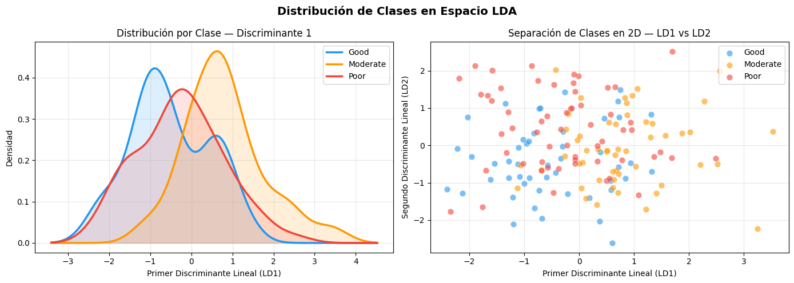
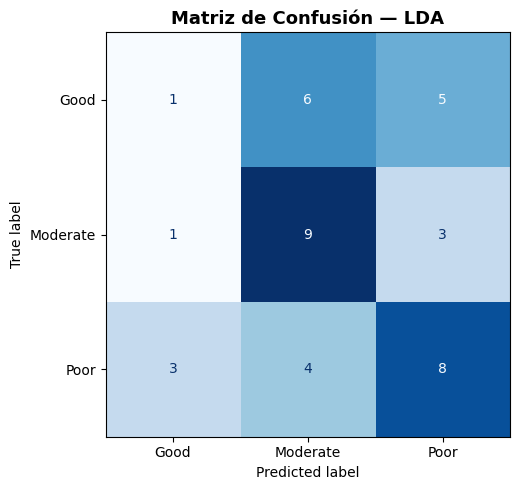
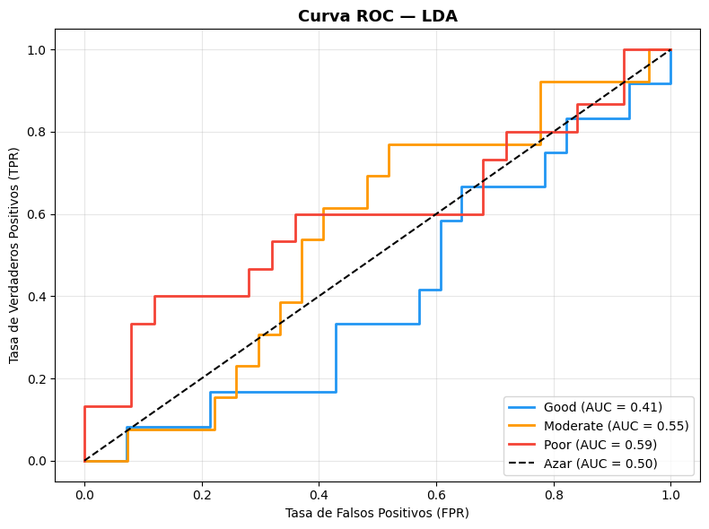

# Modelo LDA
## Linear Discriminant Analysis (LDA)

LDA es un método de clasificación que busca encontrar una combinación lineal
de features que **maximice la separación entre clases** y **minimice la
varianza dentro de cada clase**. A diferencia de la Regresión Logística,
LDA asume que los datos siguen una **distribución normal** y que todas las
clases comparten la **misma matriz de covarianza**.


### Distribución de datos

Cuando hablamos de LDA, asumimos que los datos tienen una distribucion normal, con el fin de verlo graficamente, hagamos
una grafica de la distribución de estas clases y un scatter de la misma para ver que tan bien estan separados los datos.

>Python Code


```python
import matplotlib.pyplot as plt
import numpy as np
from scipy.stats import gaussian_kde

# ── Proyectar los datos al espacio LDA ────────────────────────────
X_train_lda = modelo_lda.transform(X_train_scaled)

clases  = ['Good', 'Moderate', 'Poor']
colores = ['#2196F3', '#FF9800', '#F44336']

fig, axes = plt.subplots(1, 2, figsize=(14, 5))
fig.suptitle('Distribución de Clases en Espacio LDA', fontsize=14, fontweight='bold')

# ── Gráfica 1: Distribución 1D por cada clase (las campanas) ──────
ax = axes[0]
for clase, color in zip(clases, colores):
    # Filtrar datos de esta clase
    datos = X_train_lda[y_train == clase, 0]

    # Estimar la densidad (KDE) para suavizar la campana
    kde  = gaussian_kde(datos, bw_method=0.4)
    x    = np.linspace(X_train_lda[:, 0].min() - 1,
                       X_train_lda[:, 0].max() + 1, 300)

    ax.plot(x, kde(x), color=color, lw=2.5, label=clase)
    ax.fill_between(x, kde(x), alpha=0.15, color=color)

ax.set_title('Distribución por Clase — Discriminante 1', fontsize=12)
ax.set_xlabel('Primer Discriminante Lineal (LD1)')
ax.set_ylabel('Densidad')
ax.legend()
ax.grid(alpha=0.3)

# ── Gráfica 2: Scatter 2D en espacio LDA ──────────────────────────
ax = axes[1]
for clase, color in zip(clases, colores):
    mask = y_train == clase
    ax.scatter(X_train_lda[mask, 0], X_train_lda[mask, 1],
               color=color, label=clase, alpha=0.6, edgecolors='white',
               linewidth=0.5, s=60)

ax.set_title('Separación de Clases en 2D — LD1 vs LD2', fontsize=12)
ax.set_xlabel('Primer Discriminante Lineal (LD1)')
ax.set_ylabel('Segundo Discriminante Lineal (LD2)')
ax.legend()
ax.grid(alpha=0.3)

plt.tight_layout()
plt.show()
```

>Output




Como podemos darnos cuenta, las clases estan muy mezcladas, por lo que eso nos podria decir que sera algo 
dificil(no imposible) encontrar un buen modelo que pueda predecir correctamente.

### Crear Modelo

>Python Code


```python
from sklearn.discriminant_analysis import LinearDiscriminantAnalysis
from sklearn.metrics import accuracy_score, classification_report, confusion_matrix, ConfusionMatrixDisplay
from sklearn.preprocessing import label_binarize
from sklearn.metrics import roc_curve, auc
import matplotlib.pyplot as plta
# ── 1. Modelo LDA ─────────────────────────────────────────────────
modelo_lda = LinearDiscriminantAnalysis()
modelo_lda.fit(X_train_scaled, y_train)
```


### Predicciones y metricas

>Python Code


```python
# ── 2. Predicciones ────────────────────────────────────────────────
y_pred_lda = modelo_lda.predict(X_test_scaled)

# ── 3. Métricas ────────────────────────────────────────────────────
accuracy_lda = accuracy_score(y_test, y_pred_lda)
print(f"✅ Accuracy: {accuracy_lda*100:.2f}%\n")
print("📋 Reporte de Clasificación:")
print(classification_report(y_test, y_pred_lda))
```


>Output


```text
✅ Accuracy: 45.00%

📋 Reporte de Clasificación:
              precision    recall  f1-score   support

        Good       0.20      0.08      0.12        12
    Moderate       0.47      0.69      0.56        13
        Poor       0.50      0.53      0.52        15

    accuracy                           0.45        40
   macro avg       0.39      0.44      0.40        40
weighted avg       0.40      0.45      0.41        40

```

Bueno, mejoro un 5% mas que el modelo de regresión logistica, pero sigue sin ser muy bueno que digamos. 
Parece que solo podemos predecir de forma global el 45% de los datos de nuestro dataset, ahora veamos la matriz 
de confusión para ver que esta pasando, ya que vemos que la respuesta al tratamiento `Good`, sigue siendo muy mala.


### Matriz de confusión

>Python Code


```python
# ── 4. Matriz de Confusión ─────────────────────────────────────────
fig, ax = plt.subplots(figsize=(7, 5))
cm   = confusion_matrix(y_test, y_pred_lda, labels=modelo_lda.classes_)
disp = ConfusionMatrixDisplay(confusion_matrix=cm, display_labels=modelo_lda.classes_)
disp.plot(ax=ax, cmap='Blues', colorbar=False)
ax.set_title('Matriz de Confusión — LDA', fontsize=13, fontweight='bold')
plt.tight_layout()
plt.show()
```

>Output


La respuesta `Good`, sigue siendo la mas dificil de predecir, con solo 1 predicción correcta, sin embargo 
parece que ahora podemos predecir mejor las respuestas moderadas y pobres, lo cual es un avance.


### Curva ROC


>Python Code


```python
# ── 5. Curva ROC ───────────────────────────────────────────────────
clases     = ['Good', 'Moderate', 'Poor']
y_test_bin = label_binarize(y_test, classes=clases)
y_prob_lda = modelo_lda.predict_proba(X_test_scaled)
colores    = ['#2196F3', '#FF9800', '#F44336']

fig, ax = plt.subplots(figsize=(8, 6))
for i, (clase, color) in enumerate(zip(clases, colores)):
    fpr, tpr, _ = roc_curve(y_test_bin[:, i], y_prob_lda[:, i])
    roc_auc     = auc(fpr, tpr)
    ax.plot(fpr, tpr, color=color, lw=2,
            label=f'{clase} (AUC = {roc_auc:.2f})')

ax.plot([0, 1], [0, 1], 'k--', lw=1.5, label='Azar (AUC = 0.50)')
ax.set_title('Curva ROC — LDA', fontsize=13, fontweight='bold')
ax.set_xlabel('Tasa de Falsos Positivos (FPR)')
ax.set_ylabel('Tasa de Verdaderos Positivos (TPR)')
ax.legend(loc='lower right')
ax.grid(alpha=0.3)
plt.tight_layout()
plt.show()
```

>Output




Como se esperaba, las respuestas `Good`, estan practicamente abajo del azar, pero, podemos notar que las demas
respuestas mejoraron en su calidad de predicción.

LDA mostró una ligera mejora respecto a la Regresión Logística, alcanzando un
accuracy levemente superior. La clase `Moderate` mejoró notablemente, con 9 de
13 casos clasificados correctamente, mientras que `Poor` mantiene un desempeño
aceptable con 8 aciertos de 15.

`Good` sigue siendo la clase más difícil de predecir, con solo 1 acierto de 12,
siendo confundida principalmente con `Moderate` y `Poor`.

La curva ROC refleja este comportamiento, con AUC de **0.59** para `Poor`,
**0.55** para `Moderate` y **0.41** para `Good`, todos cercanos al azar,
lo que confirma la dificultad del modelo para separar las clases de forma confiable.


----
[Siguiente pagina]()
