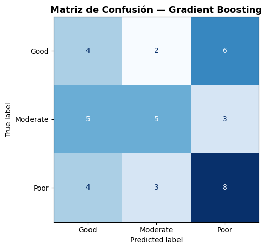
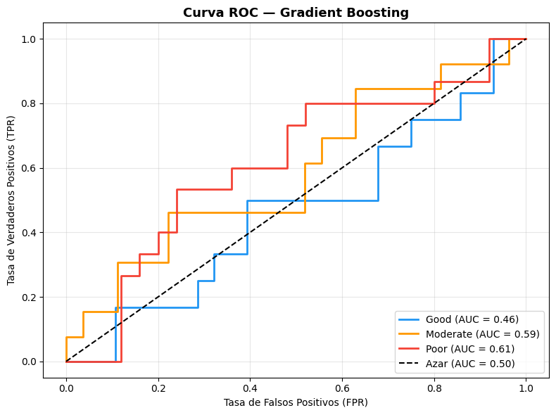
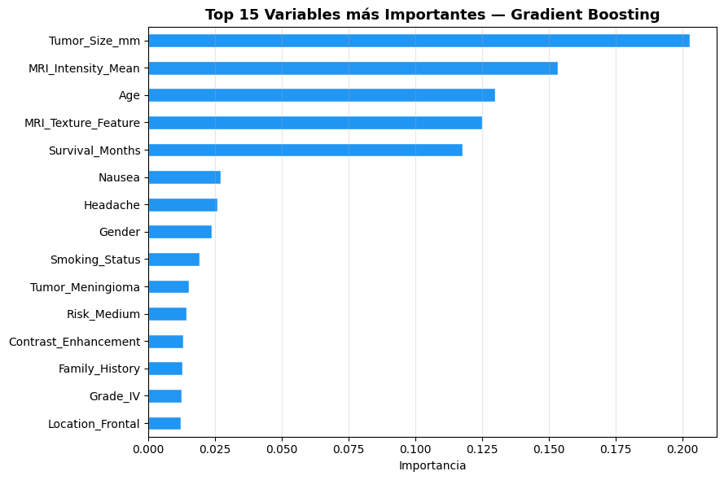

# Modelos de ensamble

## Gradient Boosting

El Boosting es un método de ensamble que construye modelos de forma **secuencial**,
donde cada modelo nuevo se enfoca en corregir los errores del anterior.
A diferencia de Random Forest que construye árboles en paralelo e independientes,
Boosting los construye uno a uno, **aprendiendo de sus errores iterativamente**.

En cada iteración, las observaciones mal clasificadas reciben **mayor peso**,
forzando al siguiente modelo a prestarles más atención:

$$F_m(x) = F_{m-1}(x) + \lambda \cdot h_m(x)$$

Donde $F_{m-1}$ es el modelo anterior, $h_m$ es el nuevo árbol correctivo
y $\lambda$ es la **tasa de aprendizaje** que controla cuánto corrige cada árbol.


Crear Modelo

>Python Code


```python
from sklearn.ensemble import GradientBoostingClassifier
from sklearn.multiclass import OneVsRestClassifier
from sklearn.metrics import accuracy_score, classification_report, confusion_matrix, ConfusionMatrixDisplay
from sklearn.preprocessing import label_binarize
from sklearn.metrics import roc_curve, auc
import matplotlib.pyplot as plt

# ── 1. Modelo Gradient Boosting ───────────────────────────────────
modelo_gb = GradientBoostingClassifier(
    n_estimators  = 100,   # Número de árboles
    learning_rate = 0.1,   # Tasa de aprendizaje
    max_depth     = 3,     # Profundidad de cada árbol
    random_state  = 42
)

modelo_gb.fit(X_train_scaled, y_train)

```


Predicciones y metricas

>Python Code


```python
# ── 2. Predicciones ────────────────────────────────────────────────
y_pred_gb = modelo_gb.predict(X_test_scaled)

# ── 3. Métricas ────────────────────────────────────────────────────
accuracy_gb = accuracy_score(y_test, y_pred_gb)
print(f"✅ Accuracy: {accuracy_gb*100:.2f}%\n")
print("📋 Reporte de Clasificación:")
print(classification_report(y_test, y_pred_gb))
```

>Output

```text
✅ Accuracy: 42.50%

📋 Reporte de Clasificación:
              precision    recall  f1-score   support

        Good       0.31      0.33      0.32        12
    Moderate       0.50      0.38      0.43        13
        Poor       0.47      0.53      0.50        15

    accuracy                           0.42        40
   macro avg       0.43      0.42      0.42        40
weighted avg       0.43      0.42      0.42        40

```


Como vemos, obtuvimos resultados peores que el anterior pero un poco mejores que la regresión logistica, 
pudiendo predecir de forma global solo el 42.5% de los datos del conjunto. De nuevo, las predicciones de `Good`,
siguen siendo las que mas traen problemas al modelo.


Matriz de confusión


>Python Code


```python
# ── 4. Matriz de Confusión ─────────────────────────────────────────
fig, ax = plt.subplots(figsize=(7, 5))
cm   = confusion_matrix(y_test, y_pred_gb, labels=modelo_gb.classes_)
disp = ConfusionMatrixDisplay(confusion_matrix=cm, display_labels=modelo_gb.classes_)
disp.plot(ax=ax, cmap='Blues', colorbar=False)
ax.set_title('Matriz de Confusión — Gradient Boosting', fontsize=13, fontweight='bold')
plt.tight_layout()
plt.show()
```

>Output




Ahora, al parecer, las respuestas que mejor puede predecir son las `poor`, Seguido de las `moderate` y luego las `good`.


Curva ROC

>Python Code


```python
# ── 5. Curva ROC ───────────────────────────────────────────────────
clases     = ['Good', 'Moderate', 'Poor']
y_test_bin = label_binarize(y_test, classes=clases)
y_prob_gb  = modelo_gb.predict_proba(X_test_scaled)
colores    = ['#2196F3', '#FF9800', '#F44336']

fig, ax = plt.subplots(figsize=(8, 6))
for i, (clase, color) in enumerate(zip(clases, colores)):
    fpr, tpr, _ = roc_curve(y_test_bin[:, i], y_prob_gb[:, i])
    roc_auc     = auc(fpr, tpr)
    ax.plot(fpr, tpr, color=color, lw=2,
            label=f'{clase} (AUC = {roc_auc:.2f})')

ax.plot([0, 1], [0, 1], 'k--', lw=1.5, label='Azar (AUC = 0.50)')
ax.set_title('Curva ROC — Gradient Boosting', fontsize=13, fontweight='bold')
ax.set_xlabel('Tasa de Falsos Positivos (FPR)')
ax.set_ylabel('Tasa de Verdaderos Positivos (TPR)')
ax.legend(loc='lower right')
ax.grid(alpha=0.3)
plt.tight_layout()
plt.show()
```

>Output





Gradient Boosting mostró una mejora general en los AUC respecto a los modelos
anteriores, siendo el primer modelo en superar **0.46** para la clase `Good`.
`Poor` mantiene el mejor desempeño con 8 aciertos y un AUC de **0.61**,
mientras que `Good` mejora notablemente respecto a modelos anteriores
con 4 aciertos de 12.

Sin embargo, `Moderate` retrocede ligeramente con solo 5 aciertos de 13,
siendo confundida principalmente con `Good`. En general, Gradient Boosting
presenta los **mejores AUC globales** de los tres modelos evaluados hasta ahora,
sugiriendo que captura mejor la estructura no lineal de los datos.


Importancia de variables


Ahora, gracias a este modelo de boosting, podemos ver cuales variables son mas relevantes.


>Python Code


```python
# ── 6. Feature Importance ─────────────────────────────────────────
importancias = pd.Series(modelo_gb.feature_importances_,
                         index=X_train.columns).sort_values(ascending=False)[:15]

fig, ax = plt.subplots(figsize=(9, 6))
importancias.plot(kind='barh', ax=ax, color='#2196F3', edgecolor='white')
ax.invert_yaxis()
ax.set_title('Top 15 Variables más Importantes — Gradient Boosting',
             fontsize=13, fontweight='bold')
ax.set_xlabel('Importancia')
ax.grid(alpha=0.3, axis='x')
plt.tight_layout()
plt.show()

```


>Output





Al parecer las variables mas importantes en este dataset, para el modelo de gradient boosting, 
es el tamaño del tumor en mm seguido de la intensidad de la resonancia magnetica promedio, la edad, entre otros,
cosa que nos puede ser de utilidad para tomar desiciones en otro tipo de modelo.


----

[Siguiente pagina]
