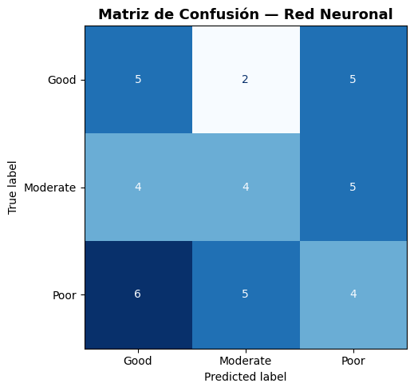
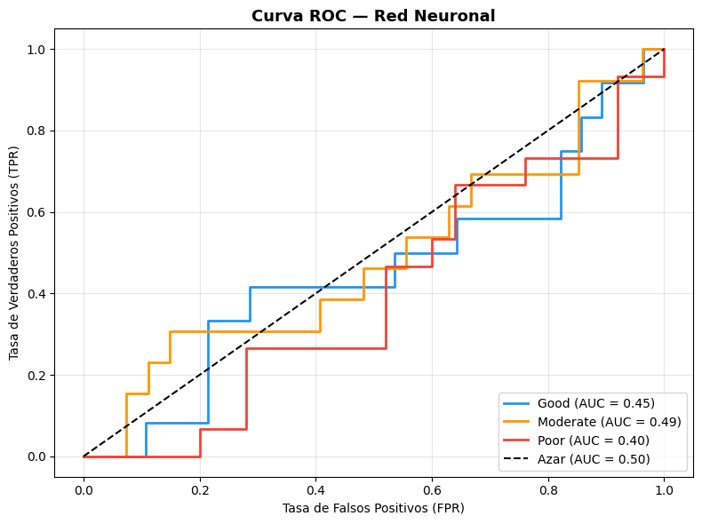
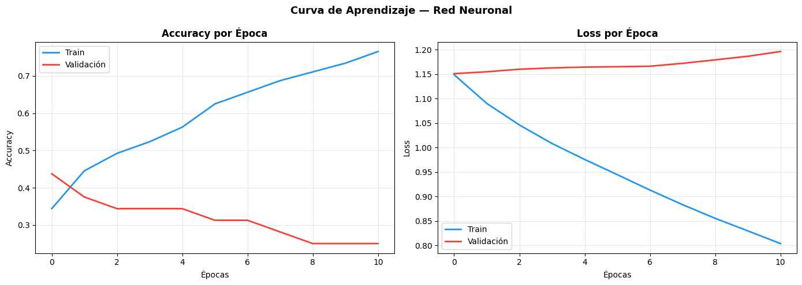

# Modelo de Redes Neuronales

Una red neuronal artificial está inspirada en el funcionamiento del cerebro humano.
Se compone de **capas de neuronas** interconectadas donde cada neurona recibe
entradas, las pondera con **pesos** $w$ y aplica una **función de activación**
para producir una salida:

$$a = f\left(\sum_{i=1}^{n} w_i x_i + b\right)$$

El aprendizaje ocurre mediante **backpropagation**, que ajusta los pesos
iterativamente minimizando el error entre la predicción y el valor real.
Utilizaremos la función de activación **ReLU** en las capas ocultas y
**Softmax** en la capa de salida para obtener probabilidades por clase.


>Nota: parece que nuestra ultima esperanza es redes neuronales.


### Crear modelo

>Python Code

```python
import tensorflow as tf
from tensorflow.keras.models import Sequential
from tensorflow.keras.layers import Dense
from tensorflow.keras.callbacks import EarlyStopping
from tensorflow.keras.optimizers import Adam
from sklearn.preprocessing import LabelEncoder
import matplotlib.pyplot as plt

# ── 1. Codificar el target a numérico (requerido por Keras) ────────
le            = LabelEncoder()
y_train_enc   = le.fit_transform(y_train)
y_test_enc    = le.transform(y_test)

print(f"📋 Codificación de clases:")
for i, clase in enumerate(le.classes_):
    print(f"   {clase} → {i}")

# ── 2. Construcción de la red neuronal ────────────────────────────
model = Sequential()
model.add(Dense(64, activation='relu', input_shape=(X_train_scaled.shape[1],)))
model.add(Dense(32, activation='relu'))
model.add(Dense(3,  activation='softmax'))  # 3 clases: Good, Moderate, Poor

model.summary()

# ── 3. Configurar fase de entrenamiento ───────────────────────────
opt = Adam(learning_rate=0.001)

model.compile(
    optimizer = opt,
    loss      = 'sparse_categorical_crossentropy',
    metrics   = ['accuracy']
)

# ── 4. Early Stopping ─────────────────────────────────────────────
early_stop = EarlyStopping(
    monitor             = 'val_accuracy',
    patience            = 10,
    restore_best_weights= True
)

# ── 5. Entrenar el modelo ─────────────────────────────────────────
history = model.fit(
    X_train_scaled, y_train_enc,
    epochs           = 100,
    validation_split = 0.2,
    batch_size       = 32,
    callbacks        = [early_stop],
    verbose          = 1
)

```


>Output


```text
Model: "sequential"
┏━━━━━━━━━━━━━━━━━━━━━━━━━━━━━━━━━┳━━━━━━━━━━━━━━━━━━━━━━━━┳━━━━━━━━━━━━━━━┓
┃ Layer (type)                    ┃ Output Shape           ┃       Param # ┃
┡━━━━━━━━━━━━━━━━━━━━━━━━━━━━━━━━━╇━━━━━━━━━━━━━━━━━━━━━━━━╇━━━━━━━━━━━━━━━┩
│ dense (Dense)                   │ (None, 64)             │         2,560 │
├─────────────────────────────────┼────────────────────────┼───────────────┤
│ dense_1 (Dense)                 │ (None, 32)             │         2,080 │
├─────────────────────────────────┼────────────────────────┼───────────────┤
│ dense_2 (Dense)                 │ (None, 3)              │            99 │
└─────────────────────────────────┴────────────────────────┴───────────────┘
 Total params: 4,739 (18.51 KB)
 Trainable params: 4,739 (18.51 KB)
 Non-trainable params: 0 (0.00 B)

```


### Metricas de desempeño

>Python Code

```python
# ── 6. Evaluación ─────────────────────────────────────────────────
y_pred_enc = model.predict(X_test_scaled).argmax(axis=1)
y_pred_nn  = le.inverse_transform(y_pred_enc)

accuracy_nn = accuracy_score(y_test, y_pred_nn)
print(f"\n✅ Accuracy: {accuracy_nn*100:.2f}%\n")
print("📋 Reporte de Clasificación:")
print(classification_report(y_test, y_pred_nn))

```


>Output

```text
Epoch 1/100
4/4 ━━━━━━━━━━━━━━━━━━━━ 3s 142ms/step - accuracy: 0.3438 - loss: 1.1491 - val_accuracy: 0.4375 - val_loss: 1.1512
Epoch 2/100
4/4 ━━━━━━━━━━━━━━━━━━━━ 0s 47ms/step - accuracy: 0.4453 - loss: 1.0904 - val_accuracy: 0.3750 - val_loss: 1.1550
Epoch 3/100
4/4 ━━━━━━━━━━━━━━━━━━━━ 0s 48ms/step - accuracy: 0.4922 - loss: 1.0464 - val_accuracy: 0.3438 - val_loss: 1.1602
Epoch 4/100
4/4 ━━━━━━━━━━━━━━━━━━━━ 0s 52ms/step - accuracy: 0.5234 - loss: 1.0085 - val_accuracy: 0.3438 - val_loss: 1.1630
Epoch 5/100
4/4 ━━━━━━━━━━━━━━━━━━━━ 0s 45ms/step - accuracy: 0.5625 - loss: 0.9759 - val_accuracy: 0.3438 - val_loss: 1.1646
Epoch 6/100
4/4 ━━━━━━━━━━━━━━━━━━━━ 0s 54ms/step - accuracy: 0.6250 - loss: 0.9448 - val_accuracy: 0.3125 - val_loss: 1.1653
Epoch 7/100
4/4 ━━━━━━━━━━━━━━━━━━━━ 0s 42ms/step - accuracy: 0.6562 - loss: 0.9134 - val_accuracy: 0.3125 - val_loss: 1.1663
Epoch 8/100
4/4 ━━━━━━━━━━━━━━━━━━━━ 0s 29ms/step - accuracy: 0.6875 - loss: 0.8835 - val_accuracy: 0.2812 - val_loss: 1.1723
Epoch 9/100
4/4 ━━━━━━━━━━━━━━━━━━━━ 0s 32ms/step - accuracy: 0.7109 - loss: 0.8556 - val_accuracy: 0.2500 - val_loss: 1.1794
Epoch 10/100
4/4 ━━━━━━━━━━━━━━━━━━━━ 0s 37ms/step - accuracy: 0.7344 - loss: 0.8299 - val_accuracy: 0.2500 - val_loss: 1.1867
Epoch 11/100
4/4 ━━━━━━━━━━━━━━━━━━━━ 0s 32ms/step - accuracy: 0.7656 - loss: 0.8040 - val_accuracy: 0.2500 - val_loss: 1.1964
2/2 ━━━━━━━━━━━━━━━━━━━━ 0s 60ms/step

✅ Accuracy: 32.50%

📋 Reporte de Clasificación:
              precision    recall  f1-score   support

        Good       0.33      0.42      0.37        12
    Moderate       0.36      0.31      0.33        13
        Poor       0.29      0.27      0.28        15

    accuracy                           0.33        40
   macro avg       0.33      0.33      0.33        40
weighted avg       0.33      0.33      0.32        40

```

Vaya, este modelo es pesimo, en toda la extension de la palabra, con un poder predictivo de 32.5 % global,
donde todas las predicciones son producto del azar segun el modelo.


### Matriz de confusión

>Python Code


```python
# ── 7. Matriz de Confusión ─────────────────────────────────────────
fig, ax = plt.subplots(figsize=(7, 5))
cm   = confusion_matrix(y_test, y_pred_nn, labels=le.classes_)
disp = ConfusionMatrixDisplay(confusion_matrix=cm, display_labels=le.classes_)
disp.plot(ax=ax, cmap='Blues', colorbar=False)
ax.set_title('Matriz de Confusión — Red Neuronal', fontsize=13, fontweight='bold')
plt.tight_layout()
plt.show()
```


>Output





Ahora, veamos la curva de aprendizaje y la curva ROC


>Python Code

```python
# ── 8. Curva de Aprendizaje ────────────────────────────────────────
fig, axes = plt.subplots(1, 2, figsize=(14, 5))

axes[0].plot(history.history['accuracy'],     color='#2196F3', lw=2, label='Train')
axes[0].plot(history.history['val_accuracy'], color='#F44336', lw=2, label='Validación')
axes[0].set_title('Accuracy por Época', fontsize=12, fontweight='bold')
axes[0].set_xlabel('Épocas')
axes[0].set_ylabel('Accuracy')
axes[0].legend()
axes[0].grid(alpha=0.3)

axes[1].plot(history.history['loss'],     color='#2196F3', lw=2, label='Train')
axes[1].plot(history.history['val_loss'], color='#F44336', lw=2, label='Validación')
axes[1].set_title('Loss por Época', fontsize=12, fontweight='bold')
axes[1].set_xlabel('Épocas')
axes[1].set_ylabel('Loss')
axes[1].legend()
axes[1].grid(alpha=0.3)

plt.suptitle('Curva de Aprendizaje — Red Neuronal', fontsize=13, fontweight='bold')
plt.tight_layout()
plt.show()

# ── 9. Curva ROC ───────────────────────────────────────────────────
y_prob_nn  = model.predict(X_test_scaled)
clases     = ['Good', 'Moderate', 'Poor']
y_test_bin = label_binarize(y_test, classes=clases)
colores    = ['#2196F3', '#FF9800', '#F44336']

fig, ax = plt.subplots(figsize=(8, 6))
for i, (clase, color) in enumerate(zip(clases, colores)):
    fpr, tpr, _ = roc_curve(y_test_bin[:, i], y_prob_nn[:, i])
    roc_auc     = auc(fpr, tpr)
    ax.plot(fpr, tpr, color=color, lw=2,
            label=f'{clase} (AUC = {roc_auc:.2f})')

ax.plot([0, 1], [0, 1], 'k--', lw=1.5, label='Azar (AUC = 0.50)')
ax.set_title('Curva ROC — Red Neuronal', fontsize=13, fontweight='bold')
ax.set_xlabel('Tasa de Falsos Positivos (FPR)')
ax.set_ylabel('Tasa de Verdaderos Positivos (TPR)')
ax.legend(loc='lower right')
ax.grid(alpha=0.3)
plt.tight_layout()
plt.show()
```


>Output





Redes neuronales, finalmente mostró hasta ahora el peor desempeño de todos los modelos evaluados, con un accuracy de **32.50%**, por debajo incluso del azar. La clase `Good`cacierto con F1 de **0.37**, siendo clasificada mas veces como `poor`.

La curva ROC nos dice que la peor curva de desempeño es la de `poor`, con un AUC de **0.40**, siendo peor que el azar.

Asi mismo vemos que tenemos una diferencia exagerada en la validacion del train y test de las curvas de accuracy y loss por epoca, lo cual sugiere problemas y muy grandes.


----
# Selección Final del modelo

# Comparativa

| Modelo                          | Accuracy (%) |
|---------------------------------|-------------|
| Linear Discriminant Analysis    | 45.00       |
| Gradient Boosting               | 42.50       |
| Logistic Regression             | 40.00       |
| Support Vector Machine (SVM)    | 37.50       |
| Red Neuronal (Keras/TensorFlow) | 32.50       |

En terminos de accuracy, el modelo con mejor desempeño, es LDA con un accuracy de **45%**, al contrario de lo que no podria pensar, una complejidad mas alta en el modelo no significa un mejor desempeño, si no al contrario, parece que a mas alta complejidad, peor desempeño en este caso.


# Conclusiones

En general lo que aprendimos de este analisis sobre la clasificación y predicción de respuesta al tratamiento de pacientes con tumores cerebrales, es que, al ser un tema relacionado a la salud, debemos ser muy criticos con lo que estamos haciendo ya que impacta mucho en las personas.

El modelo mas adecuado o aceptable seria el LDA, en terminos de accuracy, sin embargo, por su bajo porcentaje, bajo ninguna circunstancia, se motiva a usar este modelo, debido a su falta de desempeño.

Las limitaciones del estudio, posiblemente sea la base de datos en si misma, ya que al ser provenientes de kaggle, puede que los datos no se hayan trabajado correctamente o inclusive que hayan sido generados.

Una de las mejoras que se podrian hacer es que se podria buscar una base de datos mas real, con posibles huecos, outliers, valores atipicos reales, esto para trabajarlos de forma correcta con el contexto real.


Muchas gracias por tomarte el tiempo de leer este proyecto!

----
[Regresar al inicio](index.md)
