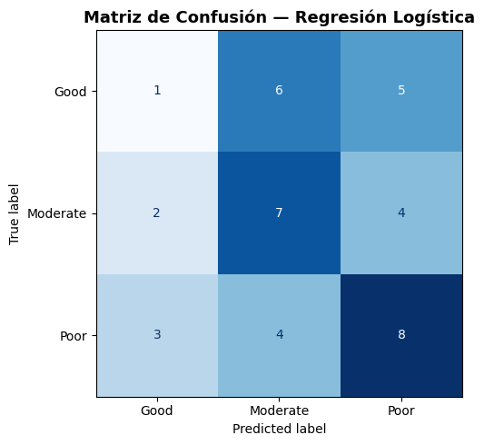
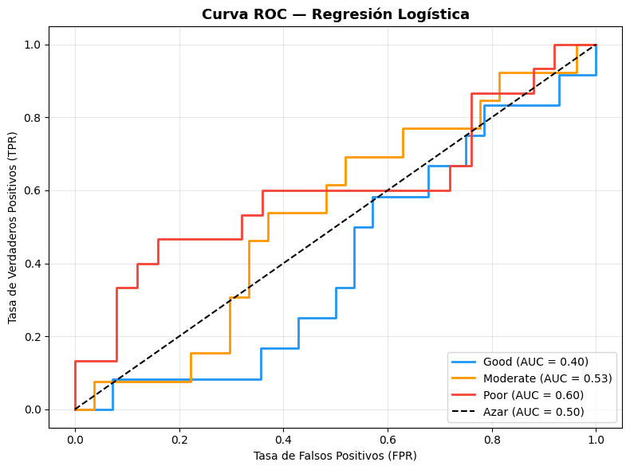

# Modelos de Clasificación

Ahora, sabiendo que la base de datos, esta lista para trabajarse, crearemos multiples modelos para comparar y 
ver cual nos da mejores resultados en la clasificación y predicción de `Treatment_response`

---


## Modelo de regresión logistica


La regresión logística es un modelo de clasificación que estima la **probabilidad**
de que una observación pertenezca a una clase. A diferencia de la regresión lineal,
su salida pasa por la **función sigmoide**, la cual transforma cualquier valor real
en un rango entre 0 y 1:

$$\sigma(z) = \frac{1}{1 + e^{-z}}$$

Donde $z$ es la combinación lineal de las variables del modelo (igual que en regresión lineal):

$$z = \beta_0 + \beta_1 x_1 + \beta_2 x_2 + \dots + \beta_n x_n$$

Como nuestro problema tiene **3 clases** (`Good`, `Moderate`, `Poor`),
se utiliza la extensión **Multinomial**, la cual en lugar de una sola función sigmoide,
aplica **Softmax** para calcular la probabilidad de cada clase simultáneamente,
asignando la clase con mayor probabilidad como predicción final.

$$P(y = k \mid x) = \frac{e^{z_k}}{\sum_{j=1}^{K} e^{z_j}}$$

---

## ¿Por qué normalizar?

Las variables numéricas del dataset como `Age`, `Tumor_Size_mm` o `Survival_Months`
tienen **escalas muy distintas**. Sin normalización, el modelo le daría más peso
a variables con valores grandes, sesgando los coeficientes $\beta$.

Con **StandardScaler** transformamos cada variable para que tenga:
- **Media = 0**
- **Desviación estándar = 1**

$$x' = \frac{x - \mu}{\sigma}$$

Esto asegura que todas las variables **compitan en igualdad de condiciones**
durante el entrenamiento.


### Normalizar datos


> Python Code


```python
from sklearn.linear_model import LogisticRegression
from sklearn.preprocessing import StandardScaler
from sklearn.metrics import accuracy_score, classification_report, confusion_matrix, ConfusionMatrixDisplay
import matplotlib.pyplot as plt

# Normalización ───────────────────────────────────────────────
scaler         = StandardScaler()
X_train_scaled = scaler.fit_transform(X_train)  # fit + transform en train
X_test_scaled  = scaler.transform(X_test)        # solo transform en test

```


### Crear modelo


> Python Code


```python
# ── 2. Modelo ──────────────────────────────────────────────────────
modelo_lr = LogisticRegression(
    multi_class  = 'multinomial',
    solver       = 'lbfgs',
    max_iter     = 1000,
    random_state = 42
)

modelo_lr.fit(X_train_scaled, y_train)
```


### Predicciones y metricas del modelo

>Python Code


```python
# ── 3. Predicciones ────────────────────────────────────────────────
y_pred = modelo_lr.predict(X_test_scaled)

# ── 4. Métricas ────────────────────────────────────────────────────
accuracy = accuracy_score(y_test, y_pred)
print(f" Accuracy: {accuracy*100:.2f}%\n")
print(" Reporte de Clasificación:")
print(classification_report(y_test, y_pred))
```

```text
 Accuracy: 40.00%

 Reporte de Clasificación:
              precision    recall  f1-score   support

        Good       0.17      0.08      0.11        12
    Moderate       0.41      0.54      0.47        13
        Poor       0.47      0.53      0.50        15

    accuracy                           0.40        40
   macro avg       0.35      0.39      0.36        40
weighted avg       0.36      0.40      0.37        40

```


Vaya, si que es malo para predecir, solo tenemos un accuracy de 40%, es decir, solo podemos 
predecir el 40% de los datos de forma global, ya que cada uno tiene su accuracy, en el f1-score,
vemos que al modelo le cuesta distinguir entre uno y otro.

Veamos la matriz de confusion para ver que estara pasando

>Python Code


```python
# ── 5. Matriz de Confusión ─────────────────────────────────────────
fig, ax = plt.subplots(figsize=(7, 5))
cm      = confusion_matrix(y_test, y_pred, labels=modelo_lr.classes_)
disp    = ConfusionMatrixDisplay(confusion_matrix=cm, display_labels=modelo_lr.classes_)
disp.plot(ax=ax, cmap='Blues', colorbar=False)
ax.set_title('Matriz de Confusión — Regresión Logística', fontsize=13, fontweight='bold')
plt.tight_layout()
plt.show()
```

>Output





### Curva ROC


>Python Code


```python

from sklearn.preprocessing import label_binarize
from sklearn.metrics import roc_curve, auc
import matplotlib.pyplot as plt
import numpy as np

# ── 1. Binarizar las clases para ROC multiclase ───────────────────
clases    = ['Good', 'Moderate', 'Poor']
y_test_bin = label_binarize(y_test, classes=clases)

# ── 2. Probabilidades predichas ───────────────────────────────────
y_prob = modelo_lr.predict_proba(X_test_scaled)

# ── 3. Calcular ROC y AUC por clase ───────────────────────────────
colores = ['#2196F3', '#FF9800', '#F44336']

fig, ax = plt.subplots(figsize=(8, 6))

for i, (clase, color) in enumerate(zip(clases, colores)):
    fpr, tpr, _ = roc_curve(y_test_bin[:, i], y_prob[:, i])
    roc_auc     = auc(fpr, tpr)
    ax.plot(fpr, tpr, color=color, lw=2,
            label=f'{clase} (AUC = {roc_auc:.2f})')

# ── 4. Línea de azar ──────────────────────────────────────────────
ax.plot([0, 1], [0, 1], 'k--', lw=1.5, label='Azar (AUC = 0.50)')

# ── 5. Formato ────────────────────────────────────────────────────
ax.set_title('Curva ROC — Regresión Logística', fontsize=13, fontweight='bold')
ax.set_xlabel('Tasa de Falsos Positivos (FPR)')
ax.set_ylabel('Tasa de Verdaderos Positivos (TPR)')
ax.legend(loc='lower right')
ax.grid(alpha=0.3)
plt.tight_layout()
plt.show()
```

>Output





El modelo alcanzó un **accuracy del 40%**, lo que indica que clasifica correctamente
4 de cada 10 pacientes en cuanto a su respuesta al tratamiento.

Analizando por clase, `Poor` y `Moderate` presentan un desempeño aceptable con
F1-scores de **0.50** y **0.47** respectivamente, mientras que `Good` resulta
ser la clase más difícil de predecir con apenas **0.11**, lo que sugiere que
el modelo tiene dificultades para distinguir a los pacientes con buena respuesta
al tratamiento.

La matriz de confusión confirma esto, ya que la mayoría de los casos `Good`
son clasificados erróneamente como `Moderate` o `Poor`, mientras que
`Poor` y `Moderate` muestran una concentración mayor en la diagonal principal,
indicando mejores aciertos en esas clases.

Por ultimo, la curva ROC para cada clase de salida nos muestra que el modelo de Regresión logistica es malisimo
para predecir si a los pacientes con buena respuesta al tratamiento, con un 0.4, estamos abajo del azar, lo cual nos 
indica que el modelo no es bueno.

----

[Siguiente pagina](modelo_lda.md)
